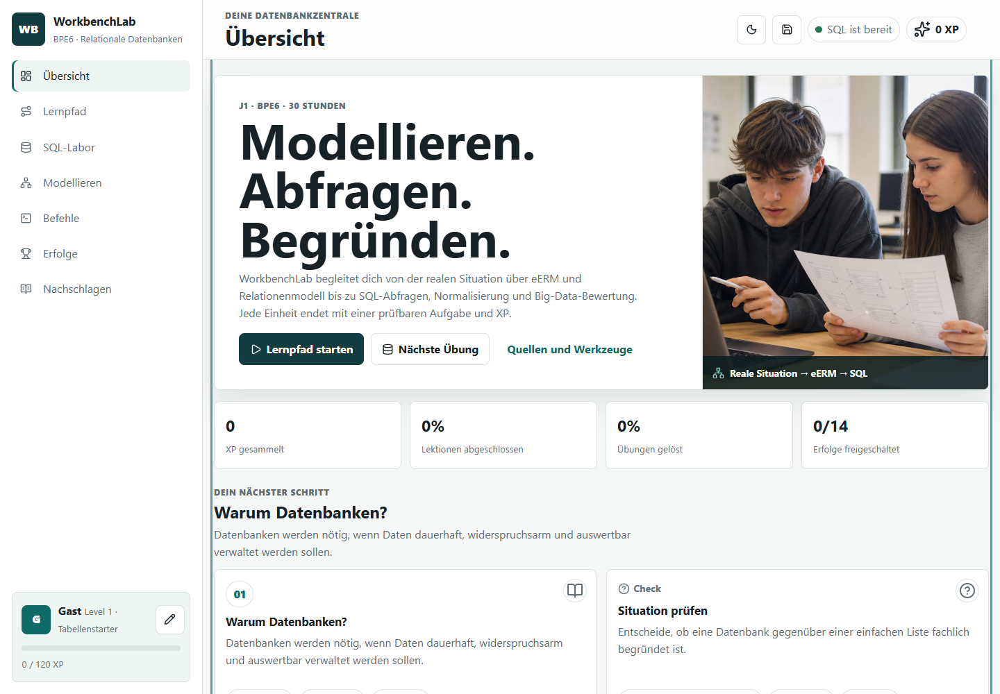
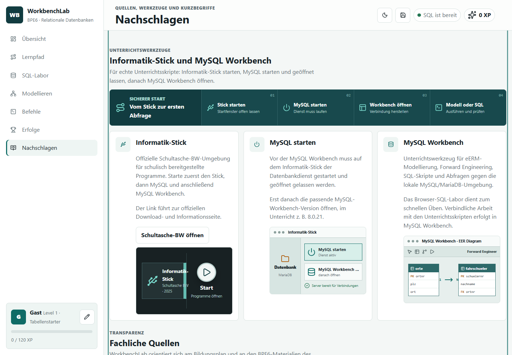
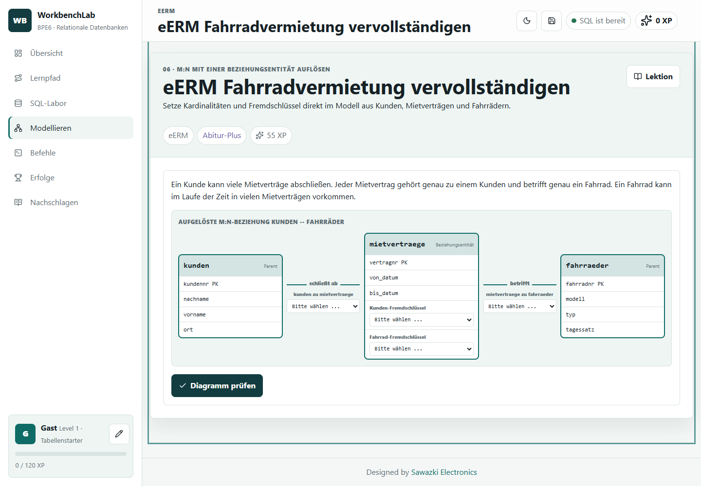
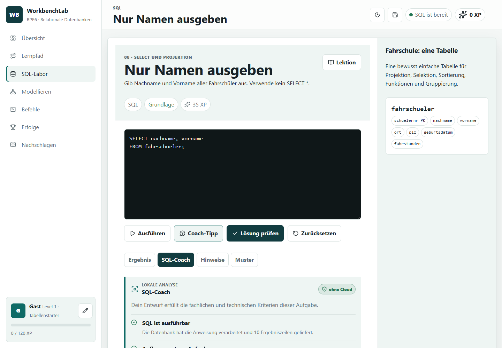

# WorkbenchLab

**Aktuelle Version:** 0.5.0

**Dokumentationsstand:** 18. Juni 2026

**Live:** <https://jakobsawazki.github.io/WorkbenchLab/>

**Repository:** <https://github.com/JakobSawazki/WorkbenchLab>

WorkbenchLab ist eine browserbasierte Lernumgebung für Jahrgangsstufe 1 im
Fach Informatik an nichtgewerblichen beruflichen Gymnasien. Inhaltlicher Kern
ist BPE6 **Relationale Datenbanken**: eERM, Relationenmodell, SQL,
Fremdschlüssel, referentielle Integrität, Normalisierung und Big Data.

Die Oberfläche orientiert sich bewusst an PythonLab: Lernpfad, Übungen, XP,
Erfolge, Nachschlagebereich, lokale Lernstandsicherung und GitHub-Pages-fähige
statische Architektur.



## Ziel

Die Schülerinnen und Schüler sollen Datenbanken nicht nur bedienen, sondern
fachlich verstehen:

1. Reale Situation analysieren.
2. Entitäten, Attribute, Beziehungen und Kardinalitäten modellieren.
3. Relationenmodell mit Primär- und Fremdschlüsseln ableiten.
4. Tabellen und Daten mit SQL aufbauen und pflegen.
5. Datenbestände mit SELECT, JOIN, Funktionen, Gruppierung und HAVING auswerten.
6. Redundanz, 3NF und Normalisierung begründen.
7. Big-Data-Chancen und -Risiken reflektiert beurteilen.

## Fachliche Grundlage

- [Bildungsplan Informatik Baden-Württemberg](https://bildungsplaene-bw.de/,Lde/In_OS_nichtTG)
- Jahrgangsstufe 1, BPE6 **Relationale Datenbanken**, 30 Stunden
- [Landesbildungsserver: Materialien zum neuen Bildungsplan Informatik](https://www.schule-bw.de/faecher-und-schularten/mathematisch-naturwissenschaftliche-faecher/informatik/material/materialien-zum-neuen-bildungsplan-informatik-an-den-nichtgewerblichen-beruflichen-gymnasien)
- Materialpaket **Relationale Datenbanken**, Stand 31.07.2025

Die vollständigen lokalen Unterrichtsmaterialien liegen unter:

`G:\Meine Ablage\Codex\WorkbenchLab\resources\bpe-6-relationale-datenbanken`

Diese Originalmaterialien dienen als fachliche Referenz und werden durch
`.gitignore` nicht in ein öffentliches Repository übernommen.

## Funktionsumfang in Version 0.5.0

- 19 Lektionen in sechs Modulen entlang der BPE6-Kompetenzspur
- 22 prüfbare Übungen mit XP
- browserbasiertes SQL-Labor über `sql.js`
- lokaler SQL-Coach mit verständlicher Syntaxübersetzung, Kriteriencheck und
  Ergebnisdiagnose ohne Cloud-Übertragung
- drei Übungsdatenbanken: eine einfache Fahrschüler-Tabelle, ein
  normalisiertes Fahrschul-Schema und eine Fahrradvermietung mit
  Beziehungsentität
- Prüfungen für Projektion, Selektion, Sortierung, `DISTINCT`, `LIKE`,
  Datumsfunktionen, Gruppierung, `HAVING`, `INSERT` und `JOIN`
- eigene eERM-Werkstatt: Sachtextanalyse, Rollen und Ereignisse,
  Kardinalitäten, Optionalität und M:N-Auflösung
- zwei interaktive eERM-Diagramme mit auswählbaren Kardinalitäten und
  Fremdschlüsseln
- drei eigens generierte, fotorealistische Unterrichtsmotive für Übersicht,
  eERM-Werkstatt und SQL-Labor
- Modellierungsübungen zu Fremdschlüsseln, Normalformen und Big Data
- Workbench-Lerneinheit zu Dienststart, Verbindung, Forward Engineering,
  Synchronisierung, Skriptimport und Ergebniskontrolle
- Befehlsbibliothek mit 17 SQL-Karten und Miniaufgaben
- XP, Level, Erfolge und Aktivitätsserie
- lokaler Lernstand mit anonymisiertem Schülerkürzel im Browser
- nachvollziehbarer JSON-Export mit Profil- und Gerätecode
- Light- und Dark-Mode
- Nachschlagebereich mit Bildungsplan, Landesbildungsserver,
  Informatik-Stick und MySQL-Workbench-Hinweisen
- eigenständige responsive Illustrationen für Informatik-Stick,
  MySQL-Dienst und eERM in Workbench statt eingebetteter Screenshots





## SQL-Labor und MySQL Workbench

Das SQL-Labor läuft vollständig im Browser und verwendet SQLite über `sql.js`.
Es ist für schnelles Üben gedacht. Die Unterrichtsumgebung bleibt:

1. Informatik-Stick starten.
2. Auf dem Stick **MySQL starten** und geöffnet lassen.
3. MySQL Workbench öffnen, z. B. Version 8.0.21.
4. Unterrichtsskripte aus den BPE6-Materialien in MySQL Workbench verwenden.

Im Browser-Labor sind ausgewählte MySQL-Funktionen wie `YEAR`, `MONTH`, `NOW`
und `DATEDIFF` als Übungshilfe nachgebildet. Für verbindliche Arbeit mit den
Originalskripten ist MySQL Workbench maßgeblich.

Der SQL-Coach analysiert die Eingabe lokal in vier Schritten: Ausführbarkeit,
geforderter SQL-Aufbau, Ergebnismenge und Sortierung. Er übersetzt typische
SQLite-Fehler in fachliche Hinweise und zeigt den nächsten Prüfschritt, ohne
eine externe API oder einen offenen Schlüssel zu verwenden.



## Technische Architektur

WorkbenchLab ist eine statische Single-Page-App ohne Build-Schritt. Die für
Icons und Browser-SQL benötigten Laufzeitdateien werden lokal mitgeliefert,
damit das Portal nicht von externen CDNs abhängt.

| Datei | Aufgabe |
| --- | --- |
| `index.html` | App-Shell, Navigation, Dialoge und Skripteinbindung |
| `styles.css` | Layout, Responsive Design, SQL-Runner, Diagramme |
| `content.js` | Lektionen, Übungen, SQL-Schemata, Befehle, Quellen |
| `app.js` | Routing, Rendering, XP, SQL-Prüfung, Export/Import |
| `assets/` | optimierte Bildserie für Unterrichtskontext; Fachdiagramme bleiben responsiv in HTML und CSS |
| `vendor/` | lokal eingebundene Laufzeitdateien für Lucide und `sql.js` |
| `docs/` | didaktische und technische Dokumentation |
| `references/bpe6/` | Quellenentscheidung und lokaler Materialüberblick |

Hash-Routing wie `#lesson/joins` oder `#practice/sql-group-having` bleibt mit
GitHub Pages kompatibel.

## Lokal starten

```powershell
cd "G:\Meine Ablage\Codex\WorkbenchLab"
python -m http.server 4174
```

Danach `http://localhost:4174` öffnen.

## GitHub Pages

Das Projekt enthält einen GitHub-Actions-Workflow unter
`.github/workflows/pages.yml`. Nach dem Push in ein GitHub-Repository kann in
den Repository-Einstellungen GitHub Pages mit **Build and deployment: GitHub
Actions** aktiviert werden.

Der Ordner `resources/` ist absichtlich ausgeschlossen, damit keine
Originalarbeitsblätter, Lösungen oder großen Materialpakete öffentlich
veröffentlicht werden.

## Datenschutz und Leistungsbewertung

WorkbenchLab speichert Schülerkürzel, Lernstand, XP, gelöste Aufgaben und
Entwürfe lokal im Browser unter `workbenchlab-v1`. Das Kürzel folgt dem Schema
`ABC.DEF`: drei Buchstaben des Vornamens, Punkt, drei Buchstaben des Nachnamens.
Es gibt kein Backend und keine zentrale Schülerdatenbank.

Beim JSON-Export werden zusätzlich eine portable Profil-ID und eine zufällige
ID des aktuellen Browserprofils ausgegeben. Die Geräte-ID ist keine
Hardware-Kennung und wird beim Import nicht übernommen. Details und Grenzen
der Zuordnung stehen in [Lernstand und Identität](docs/LERNSTAND_UND_IDENTITAET.md).

Der SQL-Coach sendet weder SQL-Code noch Profil- oder Leistungsdaten an einen
KI-Dienst. Ein optionaler KI-Ausbau ist nur über ein geschütztes serverseitiges
Gateway vorgesehen; Details stehen in `docs/SQL_FEEDBACK_UND_KI.md`.

Die XP sind motivierend und transparent, aber technisch kein
manipulationssicheres Prüfungssystem. Für die mündliche Note bzw.
kontinuierlich erbrachte Leistung ist die pädagogische Einordnung durch die
Lehrkraft maßgeblich.

## Dokumentation

- [Tasks und Projektstand](TASKS.md)
- [Technik und Didaktik](docs/TECHNIK_UND_DIDAKTIK.md)
- [Lernstand und Identität](docs/LERNSTAND_UND_IDENTITAET.md)
- [BPE6-Abgleich](docs/BPE6_ABGLEICH_2026.md)
- [BPE6-Quellenentscheidung](references/bpe6/README.md)
- [Übergabe für weitere Arbeit](UEBERGABE_Codex.md)
