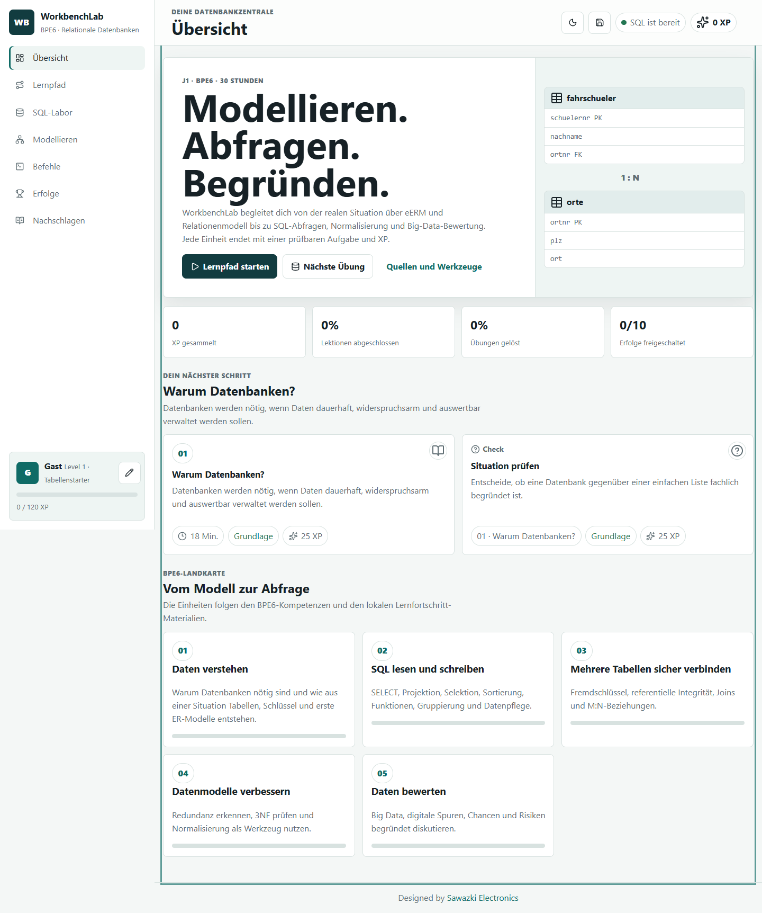

# WorkbenchLab

**Aktuelle Version:** 0.1.0

**Dokumentationsstand:** 18. Juni 2026
**Geplante Live-Adresse:** `https://jakobsawazki.github.io/WorkbenchLab/`

WorkbenchLab ist eine browserbasierte Lernumgebung für Jahrgangsstufe 1 im
Fach Informatik an nichtgewerblichen beruflichen Gymnasien. Inhaltlicher Kern
ist BPE6 **Relationale Datenbanken**: eERM, Relationenmodell, SQL,
Fremdschlüssel, referentielle Integrität, Normalisierung und Big Data.

Die Oberfläche orientiert sich bewusst an PythonLab: Lernpfad, Übungen, XP,
Erfolge, Nachschlagebereich, lokale Lernstandsicherung und GitHub-Pages-fähige
statische Architektur.



## Ziel

Die Schülerinnen und Schüler sollen Datenbanken nicht nur bedienen, sondern
fachlich verstehen:

1. Reale Situation analysieren.
2. Entitäten, Attribute, Beziehungen und Kardinalitäten modellieren.
3. Relationenmodell mit Primär- und Fremdschlüsseln ableiten.
4. Tabellen und Daten mit SQL aufbauen und pflegen.
5. Datenbestände mit SELECT, JOIN, Funktionen, Gruppierung und HAVING auswerten.
6. Redundanz, 3NF und Normalisierung begründen.
7. Big-Data-Chancen und -Risiken reflektiert beurteilen.

## Fachliche Grundlage

- [Bildungsplan Informatik Baden-Württemberg](https://bildungsplaene-bw.de/,Lde/In_OS_nichtTG)
- Jahrgangsstufe 1, BPE6 **Relationale Datenbanken**, 30 Stunden
- [Landesbildungsserver: Materialien zum neuen Bildungsplan Informatik](https://www.schule-bw.de/faecher-und-schularten/mathematisch-naturwissenschaftliche-faecher/informatik/material/materialien-zum-neuen-bildungsplan-informatik-an-den-nichtgewerblichen-beruflichen-gymnasien)
- Materialpaket **Relationale Datenbanken**, Stand 31.07.2025

Die vollständigen lokalen Unterrichtsmaterialien liegen unter:

`G:\Meine Ablage\Codex\WorkbenchLab\resources\bpe-6-relationale-datenbanken`

Diese Originalmaterialien dienen als fachliche Referenz und werden durch
`.gitignore` nicht in ein öffentliches Repository übernommen.

## Funktionsumfang in Version 0.1.0

- 13 Lektionen entlang der BPE6-Kompetenzspur
- 13 prüfbare Übungen mit XP
- browserbasiertes SQL-Labor über `sql.js`
- zwei Übungsdatenbanken: eine einfache Fahrschüler-Tabelle und ein
  normalisiertes Fahrschul-Schema mit mehreren Tabellen
- Prüfungen für Projektion, Selektion, Sortierung, Gruppierung, HAVING, INSERT
  und JOIN
- Modellierungsübungen zu Kardinalitäten, Fremdschlüsseln, Normalformen und
  Big Data
- Befehlsbibliothek mit 12 SQL-Karten und Miniaufgaben
- XP, Level, Erfolge und Aktivitätsserie
- lokaler Lernstand im Browser
- Export und Import des Lernstands als JSON-Datei
- Light- und Dark-Mode
- Nachschlagebereich mit Bildungsplan, Landesbildungsserver,
  Informatik-Stick und MySQL-Workbench-Hinweisen

## SQL-Labor und MySQL Workbench

Das SQL-Labor läuft vollständig im Browser und verwendet SQLite über `sql.js`.
Es ist für schnelles Üben gedacht. Die Unterrichtsumgebung bleibt:

1. Informatik-Stick starten.
2. Auf dem Stick **MySQL starten** und geöffnet lassen.
3. MySQL Workbench öffnen, z. B. Version 8.0.21.
4. Unterrichtsskripte aus den BPE6-Materialien in MySQL Workbench verwenden.

Im Browser-Labor sind ausgewählte MySQL-Funktionen wie `YEAR`, `MONTH` und
`DATEDIFF` als Übungshilfe nachgebildet. Für verbindliche Arbeit mit den
Originalskripten ist MySQL Workbench maßgeblich.

## Technische Architektur

WorkbenchLab ist eine statische Single-Page-App ohne Build-Schritt. Die für
Icons und Browser-SQL benötigten Laufzeitdateien werden lokal mitgeliefert,
damit das Portal nicht von externen CDNs abhängt.

| Datei | Aufgabe |
| --- | --- |
| `index.html` | App-Shell, Navigation, Dialoge und Skripteinbindung |
| `styles.css` | Layout, Responsive Design, SQL-Runner, Diagramme |
| `content.js` | Lektionen, Übungen, SQL-Schemata, Befehle, Quellen |
| `app.js` | Routing, Rendering, XP, SQL-Prüfung, Export/Import |
| `assets/` | kleine visuelle Hilfen zum Informatik-Stick |
| `vendor/` | lokal eingebundene Laufzeitdateien für Lucide und `sql.js` |
| `docs/` | didaktische und technische Dokumentation |
| `references/bpe6/` | Quellenentscheidung und lokaler Materialüberblick |

Hash-Routing wie `#lesson/joins` oder `#practice/sql-group-having` bleibt mit
GitHub Pages kompatibel.

## Lokal starten

```powershell
cd "G:\Meine Ablage\Codex\WorkbenchLab"
python -m http.server 4174
```

Danach `http://localhost:4174` öffnen.

## GitHub Pages

Das Projekt enthält einen GitHub-Actions-Workflow unter
`.github/workflows/pages.yml`. Nach dem Push in ein GitHub-Repository kann in
den Repository-Einstellungen GitHub Pages mit **Build and deployment: GitHub
Actions** aktiviert werden.

Der Ordner `resources/` ist absichtlich ausgeschlossen, damit keine
Originalarbeitsblätter, Lösungen oder großen Materialpakete öffentlich
veröffentlicht werden.

## Datenschutz und Leistungsbewertung

WorkbenchLab speichert Lernstand, XP, gelöste Aufgaben und Entwürfe lokal im
Browser unter `workbenchlab-v1`. Es gibt kein Backend und keine zentrale
Schülerdatenbank. Der Lernstand kann als JSON-Datei gesichert und wieder
geladen werden.

Die XP sind motivierend und transparent, aber technisch kein
manipulationssicheres Prüfungssystem. Für die mündliche Note bzw.
kontinuierlich erbrachte Leistung ist die pädagogische Einordnung durch die
Lehrkraft maßgeblich.

## Dokumentation

- [Tasks und Projektstand](TASKS.md)
- [Technik und Didaktik](docs/TECHNIK_UND_DIDAKTIK.md)
- [BPE6-Abgleich](docs/BPE6_ABGLEICH_2026.md)
- [BPE6-Quellenentscheidung](references/bpe6/README.md)
- [Übergabe für weitere Arbeit](UEBERGABE_Codex.md)
