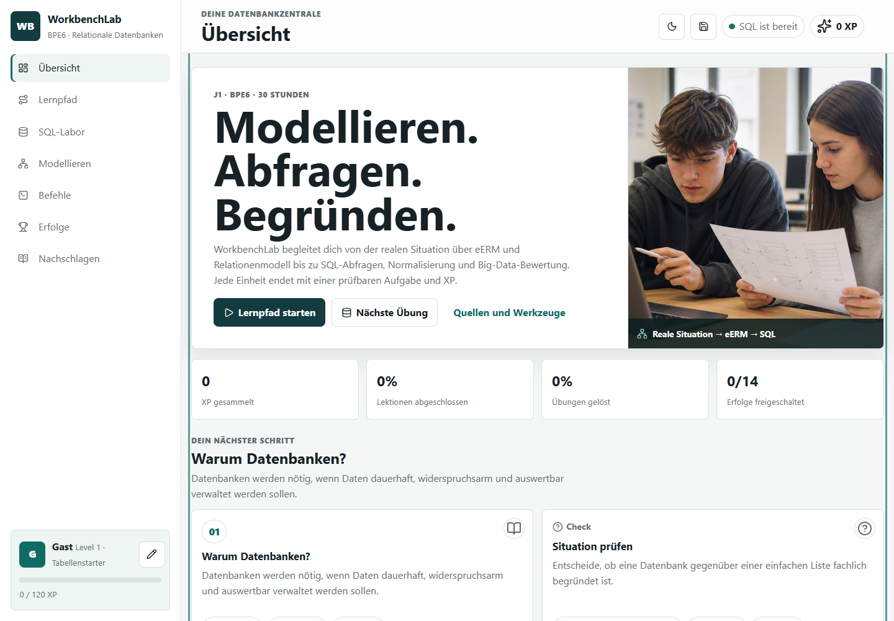
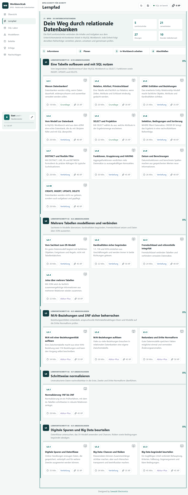
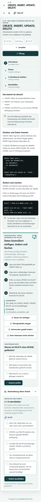
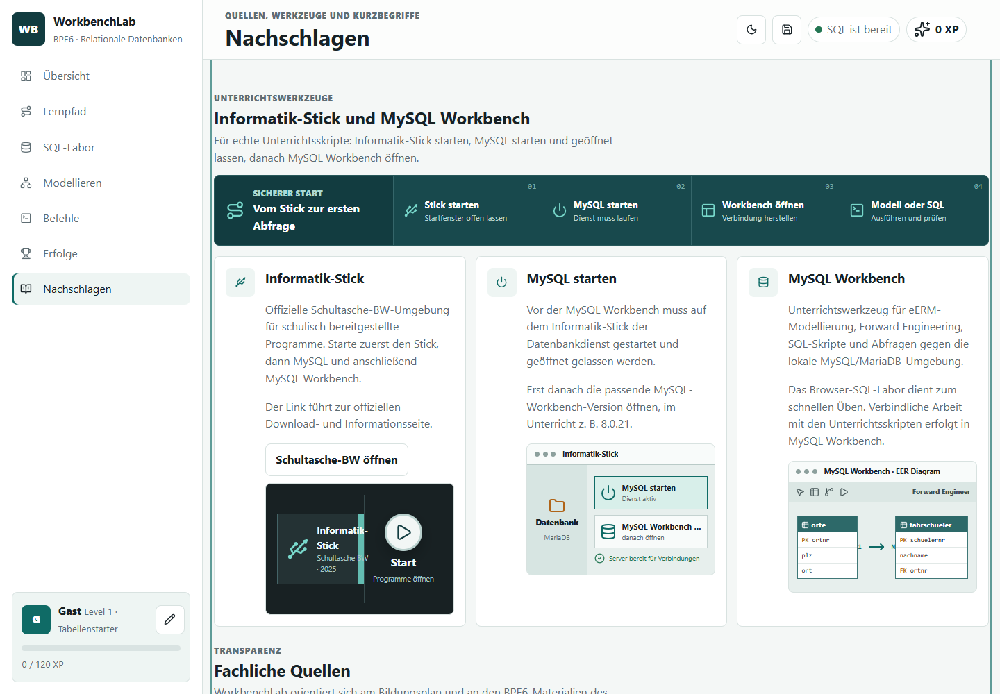
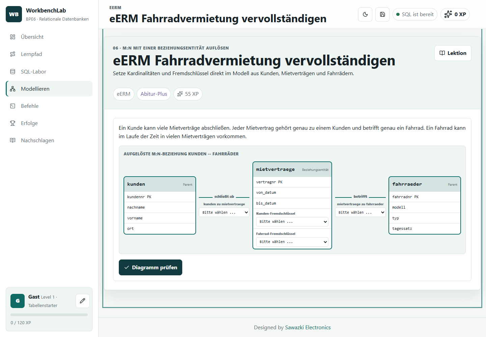
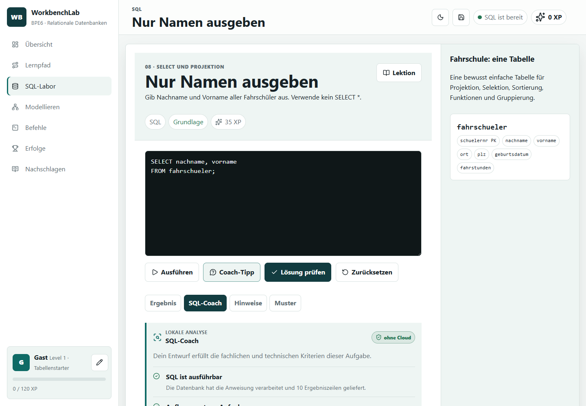

# WorkbenchLab

**Aktueller Release:** 0.25.3

**Schmalere Profilanzeige:** [Release 0.25.1](documentation/RELEASE_0_25_1.md) reduziert die Mindestbreite des Profilbuttons; Name, Klasse und XP bleiben erhalten.

**Grundfunktionen:** [Abnahme des bisherigen Stands](documentation/ABNAHME_0_22_3.md).

**Neue praktische Übungen:** [Release 0.23.0](documentation/RELEASE_0_23_0.md)
ergänzt drei SQL-Aufgaben und zwei Diagrammaufgaben. Eigene SQL-Entwürfe können
direkt als Datei für Workbench heruntergeladen werden. INSERT, UPDATE und
DELETE prüfen zusätzlich, dass unbeteiligte Datensätze erhalten bleiben.

**Veröffentlichung:** GitHub Pages, ausgelöst durch Push auf `main`.

Vor jeder Veröffentlichung müssen die Node- und Python-Tests erfolgreich sein.
Der Workflow überspringt das Deployment, sobald ein Test fehlschlägt.

## Lokale Prüfungen (OPT-10)

Voraussetzungen: Node.js ab 22, Python 3, pnpm ab 10. Für Browserprüfungen
zusätzlich Microsoft Edge. Die Anwendung selbst bleibt ohne Paketabhängigkeiten.

```sh
pnpm install --frozen-lockfile --ignore-scripts
pnpm test
pnpm test:python
pnpm serve
# In einem zweiten Terminal, während der Server läuft:
pnpm test:browser
```

Browserprüfungen verwenden `http://127.0.0.1:4174/`; eine abweichende lokale
Adresse lässt sich mit `WORKBENCH_TEST_URL` setzen. Node- und Python-Tests
benötigen keinen Server. Alternativ lassen sie sich direkt mit
`node tools/run-tests.cjs` und `python -B -m unittest discover -s tests -p 'test_*.py' -v`
starten. Historische Einzelprüfungen bleiben unverändert erhalten.

**Dokumentationsstand:** 8. Oktober 2026

**Live:** <https://jakobsawazki.github.io/WorkbenchLab/>

**Repository:** <https://github.com/JakobSawazki/WorkbenchLab>

**Lehrbuch-Manuskript:** [Entwurf und Kapitelplanung](Lehrbuch/README.md).
Die Markdown-Dateien sind öffentlich; eine integrierte Leseausgabe ist noch
nicht umgesetzt.

WorkbenchLab ist eine browserbasierte Lernumgebung für Jahrgangsstufe 1 im
Fach Informatik an nichtgewerblichen beruflichen Gymnasien. Inhaltlicher Kern
ist BPE6 **Relationale Datenbanken**: eERM, Relationenmodell, SQL,
Fremdschlüssel, referentielle Integrität, Normalisierung und Big Data.

Die Oberfläche orientiert sich bewusst an PythonLab: Lernpfad, Übungen, XP,
Erfolge, Nachschlagebereich, lokale Lernstandsicherung und GitHub-Pages-fähige
statische Architektur.

**Unterrichtsablauf:** Alle 21 Einheiten enthalten Informationen, ausfüllbare
Aufgaben, Browserübungen und anschließend einen eigenen Praxisauftrag in
MySQL Workbench. SQL und ER-/EER-Modelle werden bereits in L1.1 und L1.2
praktisch eingesetzt. Ergänzende SQL-Downloads enthalten nur fiktive
Übungsdaten. Eine neue fotorealistische Alpenkarte zeigt den Lernweg vom
Dorf zur Stadt; Markierungen, Notizen und Zeichnungen begleiten die Einheiten.
Der Lernstand lässt sich über das Diskettensymbol als JSON sichern und laden.
Ein Aufruf von `127.0.0.1` funktioniert nur auf dem jeweiligen Rechner. Vor
dem Einsatz an Schüler-PCs ist ein Test mit dem Informatik-Stick nötig. Die
Schüleroberfläche zeigt im SQL-Labor keine Musterlösung an. Alle zwölf
SQL-Downloads wurden in einer isolierten MariaDB-10.4.13-Instanz geprüft.
Die Bedienung der Workbench-Versionen auf den Schul-PCs ist damit noch nicht
nativ geprüft. [Prüfumfang und Release-Nachweise](documentation/RELEASE_0_22_0.md).

**Übersichtliche Praxisaufträge:** Seit 0.22.1 zeigen alle Arbeitsschritte eine
kurze Überschrift und eine aufklappbare vollständige Anleitung. Der erste
Schritt ist geöffnet. Details können unabhängig geöffnet und geschlossen
werden; Aufgaben und Sicherheitsregeln bleiben erhalten.

**Kleine Aufgabenabschnitte:** Seit 0.22.2 sind die zehn umfangreicheren
Aufgabenblätter in aufklappbare Abschnitte mit höchstens fünf Fragen gegliedert.
Nur der erste Abschnitt ist anfangs geöffnet. Alle 164 Antwortfelder bleiben
erhalten, einschließlich Speicherung und JSON-Sicherung. Zusatzaufgaben sind
gesondert gekennzeichnet.

**Direkter Workbench-Einstieg:** Die Praxisaufträge L1.1 bis L1.4 verlinken die
animierte Startanleitung. Die Rückkehr erhält die geöffneten Arbeitsschritte
und die Scrollposition. Das Video startet weiterhin nur auf Wunsch.



## Ziel

Die Schülerinnen und Schüler sollen Datenbanken nicht nur bedienen, sondern
fachlich verstehen:

1. Reale Situation analysieren.
2. Entitäten, Attribute, Beziehungen und Kardinalitäten modellieren.
3. Relationenmodell mit Primär- und Fremdschlüsseln ableiten.
4. Tabellen und Daten mit SQL aufbauen und pflegen.
5. Datenbestände mit SELECT, JOIN, Funktionen, Gruppierung und HAVING auswerten.
6. Redundanz, 3NF und Normalisierung begründen.
7. Big-Data-Chancen und -Risiken reflektiert beurteilen.

## Fachliche Grundlage

- [Bildungsplan Informatik Baden-Württemberg](https://bildungsplaene-bw.de/,Lde/In_OS_nichtTG)
- Jahrgangsstufe 1, BPE6 **Relationale Datenbanken**, 30 Stunden
- [Landesbildungsserver: Materialien zum neuen Bildungsplan Informatik](https://www.schule-bw.de/faecher-und-schularten/mathematisch-naturwissenschaftliche-faecher/informatik/material/materialien-zum-neuen-bildungsplan-informatik-an-den-nichtgewerblichen-beruflichen-gymnasien)
- Materialpaket **Relationale Datenbanken**, Stand 31.07.2025

Die vollständigen lokalen Unterrichtsmaterialien liegen unter:

`G:\Meine Ablage\Codex\WorkbenchLab\resources\bpe-6-relationale-datenbanken`

Diese Originalmaterialien dienen als fachliche Referenz und werden durch
`.gitignore` nicht in ein öffentliches Repository übernommen.

## Historischer Ausbau in Version 0.7.0-local

- fünf Lernfortschritte entsprechend dem lokalen Kompetenzraster
- 21 Lerneinheiten mit durchgehendem Ablauf **Informieren, Planen, in
  Workbench arbeiten, Abschließen**
- integrierte Praxisaufträge mit Lernprodukt, empfohlenem Dateinamen und
  transparentem Bezug zu Informations- und Aufgabenblättern
- Abschluss einer Einheit erst nach Selbstkontrolle, Verständnischeck und
  Bestätigung durch die Lehrkraft
- drei neue ausführbare SQL-Aufgaben für `CREATE TABLE`, `UPDATE` und `DELETE`
- zwei neue Einheiten zu digitalen Spuren und zur begründeten
  Big-Data-Fallanalyse
- 27 prüfbare Übungen mit XP
- Dark Mode als Standard und Light Mode als umschaltbare Alternative
- sequenzielle Freischaltung: zunächst L1.1, danach jeweils die nächste Einheit
- zweistufiges Lernpfad-Menü und Breadcrumbs je Lernfortschritt
- sitzungsbezogener Entwicklermodus über `AltGr + S`
- L1.1 vollständig aus Information, Aufgabe und Vorlage aufbereitet, mit
  ausfüllbarem Tabellenentwurf und eigenen Lernnotizen
- Lernprofil mit Schülerkürzel und Klasse
- JSON-Format 3 mit Profilherkunft, Übertragungshistorie und
  SHA-256-Integritätsprüfung
- kompatible Übernahme bisheriger lokaler Lernstände aus Version 0.5.0

Diese Liste dokumentiert den damaligen lokalen Ausbau. Der Lernpfad ist
inzwischen Teil der veröffentlichten Anwendung und wurde bis Version 0.22.0
um durchgängige praktische Workbench-Phasen erweitert.





## Historischer Funktionsumfang in Version 0.5.0

- 19 Lektionen in sechs Modulen entlang der BPE6-Kompetenzspur
- 22 prüfbare Übungen mit XP
- browserbasiertes SQL-Labor über `sql.js`
- lokaler SQL-Coach mit verständlicher Syntaxübersetzung, Kriteriencheck und
  Ergebnisdiagnose ohne Cloud-Übertragung
- drei Übungsdatenbanken: eine einfache Fahrschüler-Tabelle, ein
  normalisiertes Fahrschul-Schema und eine Fahrradvermietung mit
  Beziehungsentität
- Prüfungen für Projektion, Selektion, Sortierung, `DISTINCT`, `LIKE`,
  Datumsfunktionen, Gruppierung, `HAVING`, `INSERT` und `JOIN`
- eigene eERM-Werkstatt: Sachtextanalyse, Rollen und Ereignisse,
  Kardinalitäten, Optionalität und M:N-Auflösung
- zwei interaktive eERM-Diagramme mit auswählbaren Kardinalitäten und
  Fremdschlüsseln
- drei eigens generierte, fotorealistische Unterrichtsmotive für Übersicht,
  eERM-Werkstatt und SQL-Labor
- Modellierungsübungen zu Fremdschlüsseln, Normalformen und Big Data
- Workbench-Lerneinheit zu Dienststart, Verbindung, Forward Engineering,
  Synchronisierung, Skriptimport und Ergebniskontrolle
- Befehlsbibliothek mit 17 SQL-Karten und Miniaufgaben
- XP, Level, Erfolge und Aktivitätsserie
- lokaler Lernstand mit anonymisiertem Schülerkürzel im Browser
- nachvollziehbarer JSON-Export mit Profil- und Gerätecode
- Light- und Dark-Mode
- Nachschlagebereich mit Bildungsplan, Landesbildungsserver,
  Informatik-Stick und MySQL-Workbench-Hinweisen
- eigenständige responsive Illustrationen für Informatik-Stick,
  MySQL-Dienst und eERM in Workbench statt eingebetteter Screenshots





## SQL-Labor und MySQL Workbench

Das SQL-Labor läuft vollständig im Browser und verwendet SQLite über `sql.js`.
Es ist für schnelles Üben gedacht. Die Unterrichtsumgebung bleibt:

1. [Informatik-Stick über Schultasche-BW](https://schultasche-bw.de/) beziehen
   und mit dem Play-Symbol **Start** öffnen; an der Schule ist eine ältere
   Ausgabe bereits eingerichtet.
2. Unter **Datenbank MariaDB** **MySQL starten** doppelklicken, auf
   `ready for connections` warten und das Konsolenfenster geöffnet lassen.
3. In der Schule **MySQL Workbench 6.3.10** aus dem Stick öffnen. Zu Hause kann
   eine andere Stick-Version, etwa 8.0.21, angeboten werden.
4. Die lokale Verbindung in Workbench testen und erst danach Modell oder
   Unterrichtsskripte bearbeiten. Das Windows-/Microsoft-365-Passwort gehört
   nicht in die lokale Datenbankverbindung.

Im Browser-Labor sind ausgewählte MySQL-Funktionen wie `YEAR`, `MONTH`, `NOW`
und `DATEDIFF` als Übungshilfe nachgebildet. Für verbindliche Arbeit mit den
Originalskripten ist MySQL Workbench maßgeblich.

Der SQL-Coach analysiert die Eingabe lokal in vier Schritten: Ausführbarkeit,
geforderter SQL-Aufbau, Ergebnismenge und Sortierung. Er übersetzt typische
SQLite-Fehler in fachliche Hinweise und zeigt den nächsten Prüfschritt, ohne
eine externe API oder einen offenen Schlüssel zu verwenden.



## Technische Architektur

WorkbenchLab ist eine statische Single-Page-App ohne Build-Schritt. Die für
Icons und Browser-SQL benötigten Laufzeitdateien werden lokal mitgeliefert,
damit das Portal nicht von externen CDNs abhängt.

| Datei | Aufgabe |
| --- | --- |
| `index.html` | App-Shell, Navigation, Dialoge und Skripteinbindung |
| `styles.css` | Layout, Responsive Design, SQL-Runner, Diagramme |
| `content.js` | Basistexte, Übungen, SQL-Schemata, Befehle, Quellen |
| `learning-path.js` | lokaler BPE6-Lernpfad, Materialbezug, Workbench-Aufträge und ergänzende Übungen |
| `app.js` | Routing, Freischaltung, Rendering, XP, SQL-Prüfung, Export/Import |
| `assets/` | optimierte Bildserie für Unterrichtskontext; Fachdiagramme bleiben responsiv in HTML und CSS |
| `vendor/` | lokal eingebundene Laufzeitdateien für Lucide und `sql.js` |
| `documentation/documentation.md` | zentraler Versions-, Aufgaben- und Prüfstand mit didaktischen und technischen Anhängen |
| `documentation/screenshots/` | Screenshots der lokalen Entwicklungsstände |

Hash-Routing wie `#lesson/joins` oder `#practice/sql-group-having` bleibt mit
GitHub Pages kompatibel.

## Lokal starten

```powershell
cd "G:\Meine Ablage\Codex\WorkbenchLab"
python -m http.server 4174
```

Danach `http://localhost:4174` öffnen.

Die ersten Einheiten lassen sich mit `node --test tests/learning-path.test.js`
auf Vollständigkeit und Zuordnung prüfen.
Das fiktive Importskript und seine Selektionsfälle prüft
`python -B -m unittest discover -s tests -p 'test_*.py' -v`.

## GitHub Pages

Das Projekt enthält einen GitHub-Actions-Workflow unter
`.github/workflows/pages.yml`. Nach dem Push in ein GitHub-Repository kann in
den Repository-Einstellungen GitHub Pages mit **Build and deployment: GitHub
Actions** aktiviert werden.

Der Ordner `resources/` ist absichtlich ausgeschlossen, damit keine
Originalarbeitsblätter, Lösungen oder großen Materialpakete öffentlich
veröffentlicht werden.

## Datenschutz und Leistungsbewertung

WorkbenchLab speichert Schülerkürzel, Klasse, Lernstand, XP, gelöste Aufgaben,
Arbeitsblätter, Notizen und Entwürfe lokal im Browser unter `workbenchlab-v1`.
Das Kürzel folgt dem Schema `ABC.DEF`: drei Buchstaben des Vornamens, Punkt,
drei Buchstaben des Nachnamens. Es gibt kein Backend und keine zentrale
Schülerdatenbank.

Beim JSON-Export werden zusätzlich Profilherkunft, aktuelles Exportgerät,
Übertragungshistorie und eine SHA-256-Prüfsumme ausgegeben. Browser können
weder eine MAC-Adresse noch zuverlässig eine lokale IP-Adresse bereitstellen;
diese Werte werden deshalb nicht vorgetäuscht. Details und Grenzen der
Zuordnung stehen in der [Projektdokumentation](documentation/documentation.md).

Der SQL-Coach sendet weder SQL-Code noch Profil- oder Leistungsdaten an einen
KI-Dienst. Ein optionaler KI-Ausbau ist nur über ein geschütztes serverseitiges
Gateway vorgesehen; Details stehen in der [Projektdokumentation](documentation/documentation.md).

Die XP sind motivierend und transparent, aber technisch kein
manipulationssicheres Prüfungssystem. Für die mündliche Note bzw.
kontinuierlich erbrachte Leistung ist die pädagogische Einordnung durch die
Lehrkraft maßgeblich.

## Dokumentation

- [Verbindliche Projektdokumentation mit Aufgabenstand, Materialmatrix und Anhängen](documentation/documentation.md)
