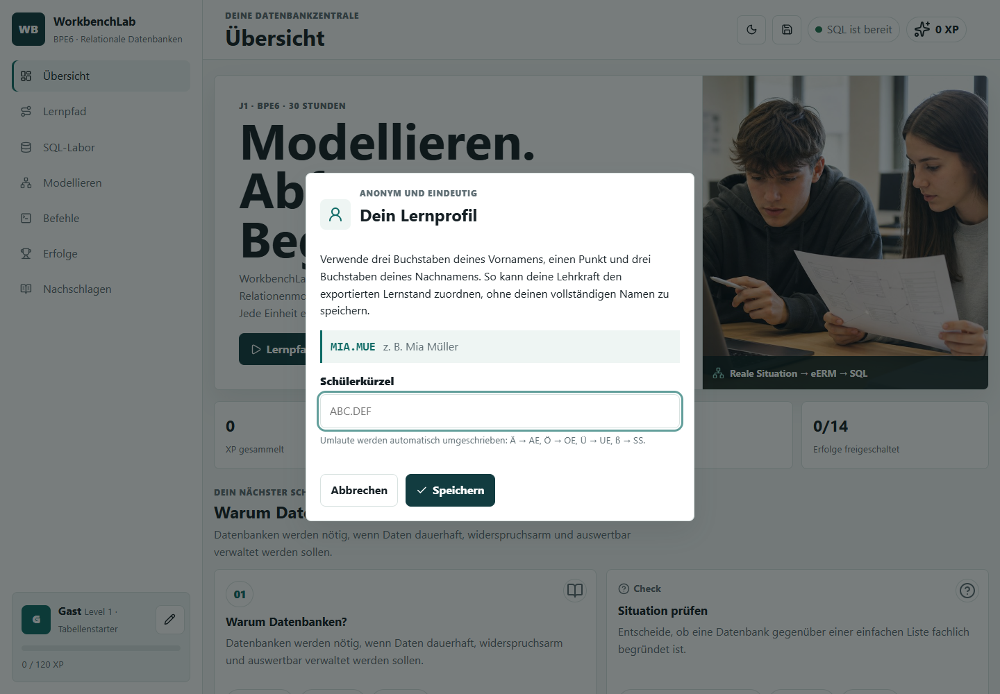

# Lernstand und Identität

Stand: 18. Juni 2026

## Schülerkürzel

WorkbenchLab speichert keinen vollständigen Namen. Schülerinnen und Schüler
verwenden ein Kürzel aus drei Buchstaben des Vornamens, einem Punkt und drei
Buchstaben des Nachnamens, zum Beispiel `MIA.MUE` für Mia Müller. Umlaute und
ß werden automatisch in `AE`, `OE`, `UE` und `SS` umgeschrieben.

Das Kürzel muss innerhalb einer Lerngruppe eindeutig vergeben werden. Bei
Namensgleichheit legt die Lehrkraft gemeinsam mit den Betroffenen ein
abweichendes, weiterhin anonymisiertes Kürzel fest.



## Zwei getrennte Identitäten

WorkbenchLab verwendet bewusst zwei zufällige IDs:

- Die `profileId` gehört zum Lernstand. Sie bleibt beim Export und Import
  erhalten und verbindet mehrere Sicherungen desselben Lernprofils.
- Die `deviceId` gehört nur zum aktuellen Browserprofil. Sie zeigt, aus welchem
  Browserprofil eine Datei exportiert wurde, und wird beim Import nicht auf das
  Zielgerät übertragen.

Beide IDs entstehen zufällig im Browser. WorkbenchLab liest weder Seriennummer,
MAC-Adresse, Betriebssystemkonto noch andere Hardware-Merkmale aus. Wird der
Browser-Speicher gelöscht oder ein anderes Browserprofil verwendet, entsteht
ein neuer Gerätecode.

## JSON-Format 2

Eine Sicherung enthält oben lesbare Identitäts- und Exportdaten:

```json
{
  "app": "WorkbenchLab",
  "formatVersion": 2,
  "appVersion": "0.5.0",
  "exportedAt": "2026-06-18T12:00:00.000Z",
  "exportId": "export_...",
  "identity": {
    "studentCode": "MIA.MUE",
    "profileId": "profile_...",
    "profileCode": "A1B2C3D4",
    "deviceId": "device_...",
    "deviceCode": "E5F6G7H8",
    "deviceCreatedAt": "2026-06-18T11:00:00.000Z"
  },
  "summary": {
    "xp": 240,
    "completedLessons": 4,
    "completedTasks": 7
  },
  "data": {}
}
```

`profileCode` und `deviceCode` sind kurze, gut vergleichbare Anzeigen der
vollständigen IDs. Jede Exportdatei bekommt außerdem eine eigene `exportId`.

## Einsatz durch die Lehrkraft

Für eine plausible Zuordnung werden Schülerkürzel, Profilcode, Gerätecode,
Exportzeitpunkt und Lernfortschritt gemeinsam betrachtet. Mehrere Abgaben
desselben Lernprofils sollten denselben Profilcode tragen. Exporte aus demselben
Browserprofil sollten denselben Gerätecode tragen.

Eine JSON-Datei kann technisch bearbeitet oder kopiert werden. Die Kennungen
sind deshalb kein Identitätsnachweis und keine alleinige Grundlage für eine
Note. Für kontinuierlich erbrachte Leistungen werden sie mit Unterrichts-
beobachtung, kurzen Erklärungen und den tatsächlich erstellten SQL- oder
Modellierungsprodukten kombiniert.

## Kompatibilität

Sicherungen mit `formatVersion: 1` bleiben importierbar. Falls darin noch ein
freier Name statt des neuen Kürzelformats steht, fordert WorkbenchLab nach dem
Import einmalig ein gültiges Kürzel an und erzeugt eine neue Profil-ID.
